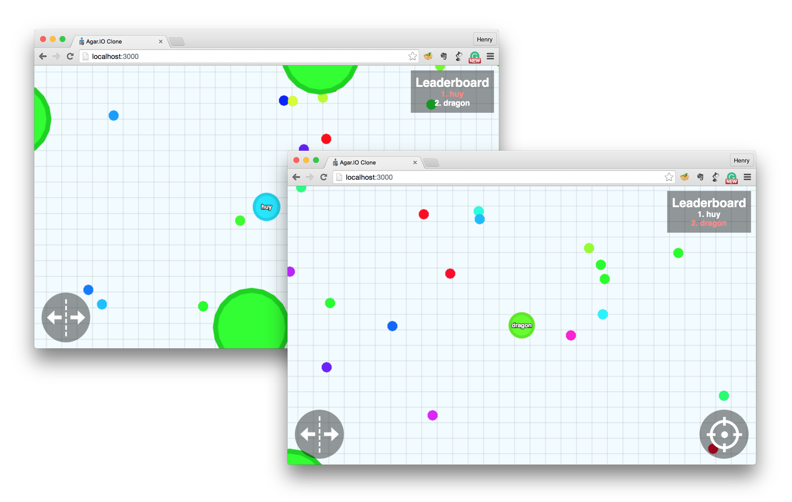

cellulr
=============

A simple but powerful spreadsheet cell based game built with socket.IO and HTML5 canvas on top of NodeJS.



## Live Demos


---

## How to Play
You can check out how to play on our [wiki](https://github.com/huytd/agar.io-clone/wiki/How-to-Play).

#### Game Basics
- Move your mouse around the screen to move your cell.
- Eat food and other players in order to grow your character (food respawns every time a player eats it).
- A player's **mass** is the number of food particles eaten.
- **Objective**: Try to get as big as possible and eat other players.

#### Gameplay Rules
- Players who haven't eaten yet cannot be eaten as a sort of "grace" period. This invincibility fades once they gain mass.


---

## Latest Changes
- Game logic is handled by the server
- The client side is for rendering of the canvas and its items only.
- Mobile optimisation.
- Implementation of working viruses.
- Display player name.
- Now supporting chat. 
- Type`-ping` in the chatbox to check your ping, as well as other commands!

---

## Installation
You can simply click one of the buttons below to easily deploy this repo to Bluemix or Heroku:

[](https://bluemix.net/deploy?repository=https://github.com/huytd/agar.io-clone)
[](https://heroku.com/deploy)

Or...

>You can check out a more detailed setup tutorial on our [wiki](https://github.com/huytd/agar.io-clone/wiki/Setup).

#### Requirements
To run / install this game, you'll need: 
- NodeJS with NPM installed.
- socket.IO.
- Express.


#### Downloading the dependencies
After cloning the source code from Github, you need to run the following command to download all the dependencies (socket.IO, express, etc.):

```
npm install
```

#### Running the Server
After downloading all the dependencies, you can run the server with the following command:

```
npm start
```

The game will then be accessible at `http://localhost:3000` or the respective server installed on. The default port is `3000`, however this can be changed in config. Further elaboration is available on our [wiki](https://github.com/huytd/agar.io-clone/wiki/Setup).


### Running the Server with Docker
If you have [Docker](https://www.docker.com/) installed, after cloning the repository you can run the following commands to start the server and make it acessible at `http://localhost:3000`:

```
docker build -t agarioclone_agar .
docker run -it -p 3000:3000 agarioclone_agar
```

---

## FAQ
1. **What is this game?**

  
6. **Can I use some code of this project on my own?**

  Yes you can.
 -


## License
>You can check out the full license [here](https://github.com/huytd/agar.io-clone/blob/master/LICENSE).


